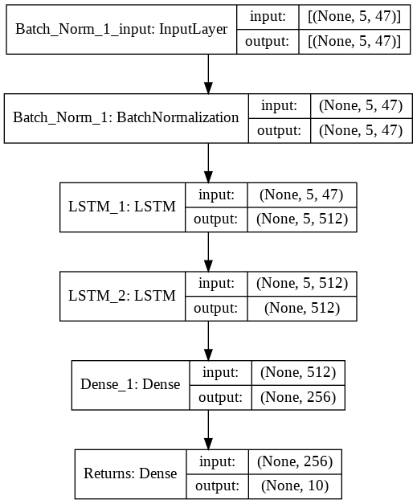
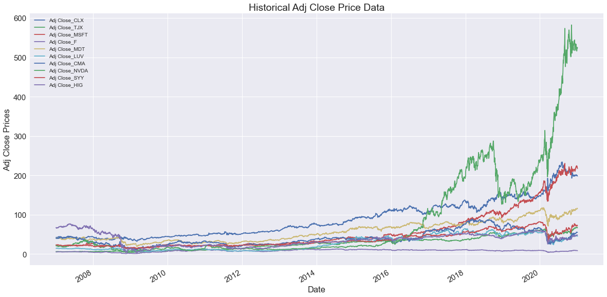

# __*Portfolio Management with Deep Learning:* Forecasting returns and managing possitions.__
***
## [Medium Article](https://alejandro19971231.medium.com/deep-learning-and-portfolio-management-b3b983528a06)
## 1. Introduction: Motivation for this Project
With the development of deep learning and the increasing availability of free high frequency financial data online, the opportunities to implement this techniques to forecast the behavior and manage assets arise. Taking advantage of this available information for decision making is key to build a great portfolio and decide asset allocations.

In this project I use machine learning algorithms, in particular *recurrent neural networks*, to forecast the returns of assets of a defined asset universe. With this forecast, I then optimize the portfolio weights and take possitions on each asset, creating the future optimal portfolio. The forecasting algorithm used is a Recurrent Neural Network with LSTM cells, whose final structure is:

The objective of this project is to define a concrete portfolio universe (set of stocks that are available to use in the portfolio), which is demarcated by the stocks that have been in the S&P500 stock index since at least January of 2007. With the historical price data of a subset of 10 of these stocks, I train a return forecasting model.

The idea of the returns forecast is that the investor has the capability to act on time, allocating adequately the funds among the assets that conform the portfolio (represented by the weights of each asset in the portfolio during the time period of analysis). This is done by finding the optimal weights, or participations, such that the Sharpe Ratio of the portfolio is maximized.
***

## 2. Data

The data used are the daily stock prices from a subset of stocks which have participated in the S&P500 index since at least january 2007. This data was taken from [Yahoo Finance](https://finance.yahoo.com) through the [`yfinance`](https://pypi.org/project/yfinance/) API. Also I use the [`quandl`](https://github.com/quandl/quandl-python) API for the money market rates, which extracts the data from the [Federal Reserve (FRED)](https://fred.stlouisfed.org).

The data used correspond to a subset of 10 stocks from the S&P500 index, with with information from at 2007-01-04 to 2021-01-04. 

The historical prices and much more are analized before modeling the returns.

A very important file can be found in `financial_data.py` which contains most of the preprocessing code used, as well as plenty of useful functions.
***

## 3. Documentation
The main files of the project are:
1. `financial_data.py`: contains the classes and functions used for the project, from the `FinancialData` class used to extract and analyze the data to the portfolio optimization functions.
2. `notebook.ipynb`: contains the development of the project in an ordered way. It is divided into 4 sections, that describe and show the process of extracting the data, analyzing it, modeling it and optimizing the portfolio. 

For a detailed explanation of the process and main results, I invite you to read my [Medium Article](https://alejandro19971231.medium.com/deep-learning-and-portfolio-management-b3b983528a06).

Beyond the code, it is very important to understand the underlying financial theory, as well as the architecures of the models used. For this it could be very helpful to take a look to the Udacity course [*Machine Learning for Trading*](https://classroom.udacity.com/courses/ud501) for the finacial basics. 

To go further, it is also very helpful to read [*Machine Learning for Algoritmic Trading*](https://www.packtpub.com/product/machine-learning-for-algorithmic-trading-second-edition/9781839217715).
***

## 4. Tools and Software Used:
Most of the project is composed of two files:
1. A jupyter notebook developed in JupyterLab (v.3.0.11), where the body and explanation of the project is presented.
2. financial_data.py, which contains key classes and functions, which are continually used through out the development of the project.

I also used Google Colab to train the RNN, taking advantage of the GPU service it provides.

The principal libraries used are:
+ [Tensorflow](https://www.tensorflow.org): v. 2.4.1
+ quandl
+ [Pandas](https://pandas.pydata.org): v.1.1.3
+ [Numpy](https://numpy.org): v.1.19.2
+ [Matplotlib](https://matplotlib.org): v.0.23.2
+ [Scikit-Learn](https://scikit-learn.org/stable/): v.3.3.2
+ [Yahoo Finance API](https://pypi.org/project/yfinance): v.0.1.54

***
## 5. Conclusions
After the modeling process, one thing stood out: even though I used a relatively complex model (with almost 3.4 million parameters), the returns of the assets continued to be a very difficult target variable to forecast. To improve the results, first I used more complex architectures, improving significantly the results compared with the simpler models. Other important step that improved the results was the use of the learning rate schedule to select a better learning rate for the model. 

Finally, thanks to the availability of financial data in platforms such as Yahoo Finance or Quandl, and the development of deep learning techniques, such as the recurrent neural nets used, an investor could improve his/her portfolio management abilities. This new technology and techniques can be combined with traditional methods, such as the optimization of the portfolio shown, to automate and create a better criteria to allocate the funds. However, there are many challenges in the area of return forecasting, due to the noisy nature of this data.

There are many things left to explore further, such as the use of higher frequency data, which a neural network could harness. Or the use of specialized models for each of the stock’s returns that conform the portfolio. Also we could use manage a bigger portfolio, or find/create new factors to use as input variable for the deep learning model.

Additionally, there are many new data sources of non-traditional data. Examples of this are the use of NLP to capture the sentiment of the market through the live feed of news and tweets, or the harnessing of satellite images through computer vision algorithms (e.g. CNNs). These goes beyond of finding new and better factors to enhance our models, we need to be creative and exploit every byte of data that the digital era has brought.
***

## 6. License

This software is licensed under the [MIT](https://opensource.org/licenses/MIT) license. The license can be found in the `license.txt` file. 
***

## 7. Acknoledgements

This project was done as part of the [Udacity](udacity.com) Data Science Nano Degree, and with the help of the course [*Machine Learning for Trading*](https://classroom.udacity.com/courses/ud501). 

Also, I would like to thank the free online education platforms [Coursera](https://www.coursera.org), in particular [Deeplearning.ai](https://www.deeplearning.ai) and [Edx](https://www.edx.org), which helped me to get started in this path.